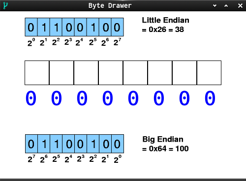

###Byte Drawer

Flipping Bits on a real char and visualize that.

A Byte is the smallest addressable chunk of memory on most platforms.
This program can help to understand how a byte is ordered and may help to understand what an address pointer is. A character type in C has per definition the size of one byte.  
`sizeof(char);`

This is WORK IN PROGRESS.

The code is nearly at a fork state.
But currently only works for little Endian.  

* fork 1 is an educational program to learn about Bit-order aka endianess.

* fork 2 is a pixel drawer to make monochromatic assets for classic VCS.

* fork 3 could be a fully fledged Pixel/Icon Editor.

Left MB for bit flipping.  
key w = write Byte as char to data file  
key r = read Byte as char to data file  

[Get in touch on SDL-Discourse](https://discourse.libsdl.org/u/Acry/summary) | [My IO-Site](https://acry.github.io/)  

